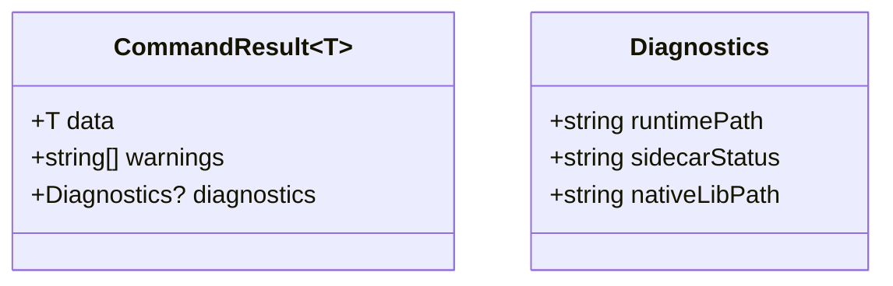

# API Specification (Renderer <-> Backend)

## Purpose

Define the command boundary exposed by Tauri so UI, backend, and native integration can evolve without contract drift.

---

## Scope

In scope:

- Tauri command contracts used by the renderer.
- Command intent, payload stability, and response conventions.
- Error propagation expectations for backend, Sidecar Process, and Native Bridge failures.

Out of scope:

- Internal domain method signatures.
- Native C/C++ ABI definitions.

---

## Preconditions

- Renderer calls backend exclusively through command wrappers.
- Command handlers remain centralized in `src-tauri/src/commands.rs`.
- Logging/redaction policy is active for command request/response paths.

---

## Flow

### Contract principles

- Keep command names and payloads stable across minor releases.
- Additive changes are preferred over breaking shape changes.
- Error responses must be actionable (not just generic failure text).
- Log redaction policy applies to all command paths.

---

### Command catalog

| Command | Intent | Typical caller |
| --- | --- | --- |
| `prepare_bundled_jlink` | Run Runtime Preparation and load the Native Bridge for the current target | bootstrap/startup |
| `detect_and_scan` | Complete scan flow with Runtime Prepared context | startup and post-operation refresh |
| `scan_probes` | Probe scan only (Runtime Prepared already true) | manual refresh |
| `switch_usb_driver` | Execute WinUSB Switch Flow for the selected probe | dashboard switch action |
| `get_jlink_diagnostics` | Return Runtime Preparation, Sidecar Process, and Native Bridge diagnostics | support and troubleshooting |

---

### Request/response shape (recommended pattern)

Use this shape consistently when introducing new commands so frontend error and telemetry handling stays uniform.

---

## Failure handling

- Validation errors: fail fast at command boundary.
- Runtime readiness errors: return explicit “Runtime not prepared” context.
- Sidecar Process/Native Bridge failures: surface both a user-safe summary and detailed diagnostic fields when allowed.

---

## Ownership

- Renderer command client: `src/renderer/api/commands.ts`
- Command boundary and validation: `src-tauri/src/commands.rs`
- Domain execution and normalization: `src-tauri/src/domain/*`

