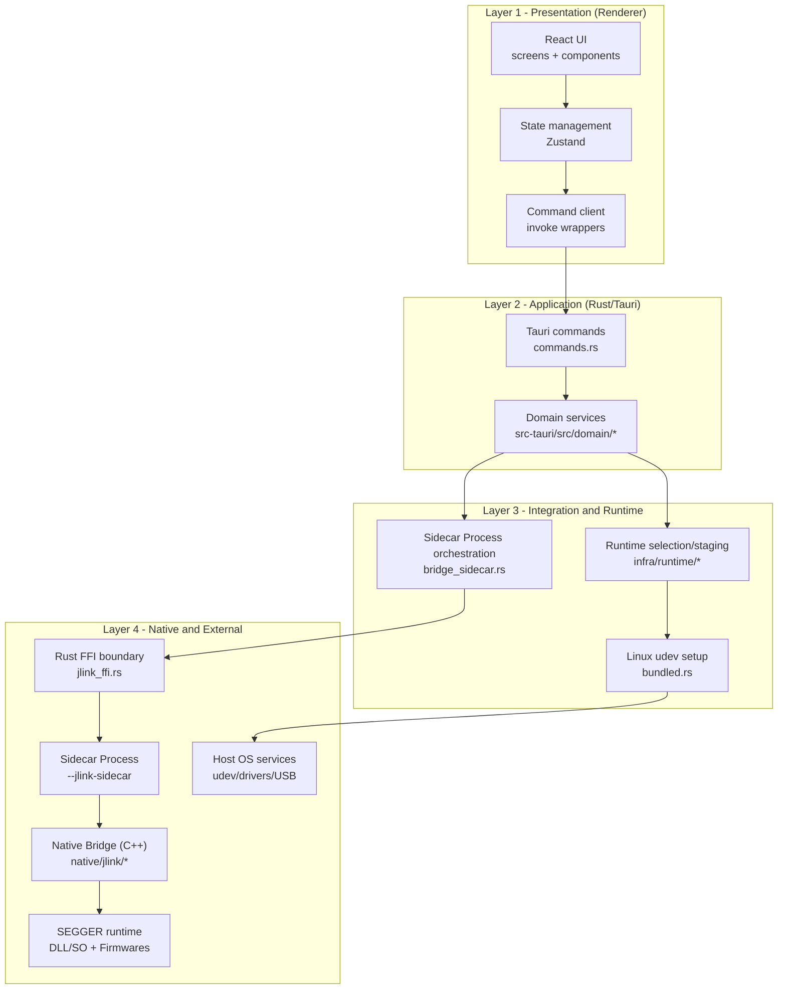
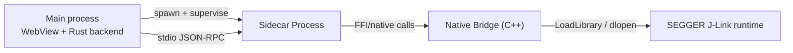
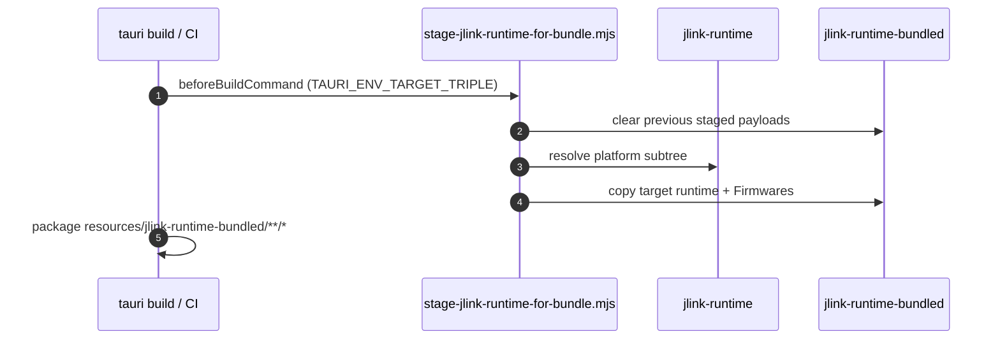

# Architecture Specification

## Purpose

This document defines the system structure, boundaries, and dependency rules for maintainers and future contributors.

## Scope

In scope:

- Renderer (React/TypeScript)
- Tauri backend (Rust commands and domain)
- Native Bridge integration layer (Rust FFI + Sidecar Process + C++)
- Runtime bundling strategy and process boundaries

Out of scope:

- Detailed UI/UX behavior
- Hardware validation procedures (see release checklist/testing docs)

---

## Preconditions

- Repository structure and paths referenced in this document match the current codebase.
- Runtime artifacts are staged using the documented build/runtime scripts.
- Sidecar Process execution model remains enabled for Native Bridge calls.

---

## Flow

### Layered architecture (authoritative view)

Dependency rule: **higher layers may depend on lower layers; lower layers must not depend on higher layers**.

---

### Deployment/process architecture

Rationale:

- Native faults are isolated from the main process.
- Sidecar Process can be restarted without tearing down the UI.

---

### Runtime bundling model

There are two runtime trees by design:

- `src-tauri/resources/jlink-runtime/` (full source runtime set)
- `src-tauri/resources/jlink-runtime-bundled/` (target-filtered payload included in installers)

---

## Failure handling

- Violations of layer dependency direction must be treated as architecture regressions.
- Native Bridge instability is contained by Sidecar Process isolation and restart boundaries.
- Runtime staging mismatches must fail early in build/release validation.

---

## Ownership

### Ownership map

- Renderer: `src/renderer/*`
- Command layer: `src-tauri/src/commands.rs`
- Domain logic: `src-tauri/src/domain/*`
- Sidecar Process orchestration: `src-tauri/src/bridge_sidecar.rs`
- FFI boundary: `src-tauri/src/jlink_ffi.rs`
- Native Bridge: `src-tauri/native/jlink/*`
- Runtime and platform bootstrapping: `src-tauri/src/infra/runtime/*`

