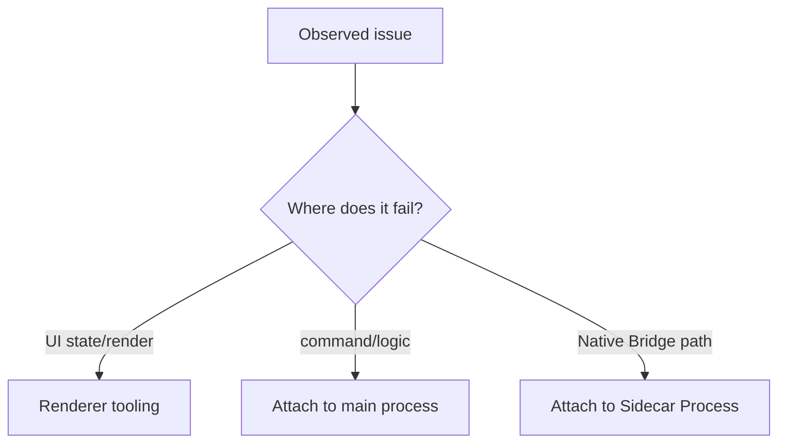

# Debugging Guide

## Purpose

Provide a repeatable procedure to diagnose issues across:

- Renderer/UI behavior
- Tauri command and Rust domain logic
- Sidecar Process/Native Bridge execution

---

## Scope

In scope:

- Live debugging and attach strategy for renderer, backend, and Sidecar Process/Native Bridge paths.
- Evidence collection for reproducible triage.
- Common failure playbooks for Runtime Preparation, Linux permissions, and WinUSB Switch Flow instability.

Out of scope:

- Performance profiling and benchmark methodology.
- Production telemetry dashboard design.

---

## Preconditions

- Development dependencies are installed.
- App can be launched in dev mode.
- Developer can attach debugger to main and Sidecar Process targets.

---

## Flow

### 1. Start a debug session

```bash
yarn install
yarn tauri:dev
```

The dev launcher script resolves port conflicts and starts Tauri with dev config overlays.

---

### 2. Choose debug target correctly



### Process roles

- **Main app process**: WebView + Rust backend commands
- **Sidecar Process**: `--jlink-sidecar`, hosts Native Bridge calls

If multiple app-like processes exist, select the one with `--jlink-sidecar` to debug Native Bridge path issues.

---

### 3. VS Code attach matrix

- Windows:
  - `cppvsdbg` for MSVC-native attach
  - CodeLLDB attach when LLDB toolchain is preferred
- Linux:
  - CodeLLDB or `cppdbg` (gdb)

Recommended:

- Use **main process attach** for command orchestration bugs.
- Use **Sidecar Process attach** for Native Bridge behavior, crashes, and library-loading issues.

---

### 4. Logging and evidence collection

Minimum evidence bundle when triaging:

1. User action + timestamp
2. Main backend logs (operation ID if available)
3. Sidecar Process/Native Bridge logs
4. Platform diagnostics (`get_jlink_diagnostics`) output

Log and cache location policy:

- Expected log and cache root is inside the installation directory.
- `AppData`-based paths are out of policy for this application specification.

Triaging rule:

- Find the **first failing boundary** (startup -> Runtime Preparation -> Sidecar Process -> Native Bridge call), not just the final UI message.

---

### 5. Scenario playbooks

### A. Runtime not loaded

Symptoms:

- “Native Bridge not loaded”
- “J-Link API not loaded”

Checks:

- Runtime staging output exists in `resources/jlink-runtime-bundled/**/*`
- Target-matching library exists (`JLink_x64.dll` / `JLinkARM.dll` / `libjlinkarm.so`)
- `prepare_bundled_jlink` and Sidecar Process load logs indicate successful load path
- Install-root log file is writable and receives appended entries across restarts

### B. Linux permission denied

Checks:

- udev rules are present and valid
- privilege escalation (`pkexec`) completed successfully
- device was unplugged/replugged after rule update

### C. WinUSB Switch Flow instability

Checks:

- native logs around reboot/reconnect wait
- post-switch scan payload and timing
- OS-level enumeration evidence (`dmesg` on Linux, Device Manager/events on Windows)

---

## Failure handling

- If attach fails, verify process selection (`--jlink-sidecar` for Native Bridge path) and retry.
- If evidence is incomplete, stop and collect the minimum bundle before root-cause analysis.
- If startup/Runtime Preparation fails, prioritize first failing boundary and avoid UI-only conclusions.

---

## Ownership

- Debug configuration and launch profiles: `.vscode/*`
- Backend/Sidecar Process logs and diagnostics: `src-tauri/src/*`, `src-tauri/native/jlink/*`
- Troubleshooting procedures: this document and `PLATFORM_NOTES.md`

