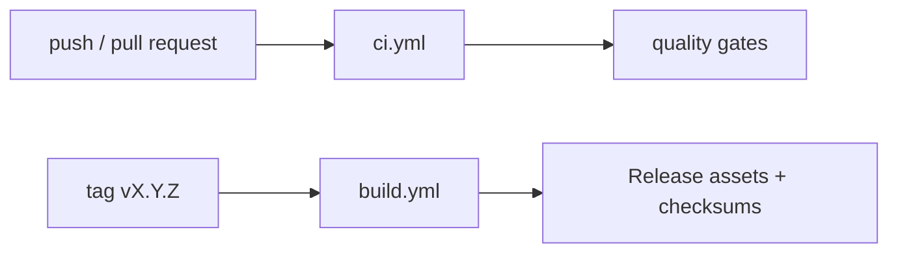

# CI and Release Specification (GitHub)

## Purpose

Define CI quality gates and release mechanics for maintainers.

---

## Scope

In scope:

- CI quality gates required for release readiness.
- Tag-triggered release flow and expected assets.
- Maintainer actions before and after tag publication.
- Runtime Preparation artifact correctness in packaged outputs.

Out of scope:

- Branching strategy and sprint/release planning policy.
- External distribution channel procedures after artifact publication.

---

## Preconditions

- Version fields are aligned across package manifests.
- Required CI secrets/runners are available.
- Release commit has passed all required gates.

---

## Flow

### Pipeline model

Primary workflows:

- `.github/workflows/ci.yml` for validation gates
- `.github/workflows/build.yml` for tagged release artifacts

---

### Quality gates (expected)

- Frontend lint/test/build
- Rust fmt/clippy/test/build
- Packaging smoke validation as defined in workflow

Any gate failure blocks release readiness.

---

### Release procedure

1. Align version fields:
   - `package.json`
   - `src-tauri/tauri.conf.json`
   - `src-tauri/Cargo.toml`
2. Confirm CI is green on the intended release commit.
3. Create annotated tag `vX.Y.Z`.
4. Push tag and monitor `build.yml`.
5. Verify release assets and checksum files.

---

### Expected release assets

- Windows installers (`.exe`, `.msi`)
- Linux installers (`.deb`, `.AppImage`)
- Checksum artifacts (`SHA256SUMS*.txt`)

---

## Failure handling

- Any failed quality gate blocks release and must be resolved before tagging.
- Missing or partial assets require rerun/rebuild before publication is considered complete.
- Checksum mismatch or missing checksum files invalidates release readiness.
- Missing Runtime Preparation payloads in installers invalidates release readiness.

---

## Ownership

- CI workflow definitions: `.github/workflows/*`
- Version alignment before release: `package.json`, `src-tauri/Cargo.toml`, `src-tauri/tauri.conf.json`
- Release validation and publication: maintainers/release engineers

