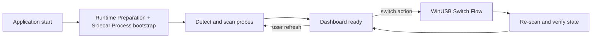
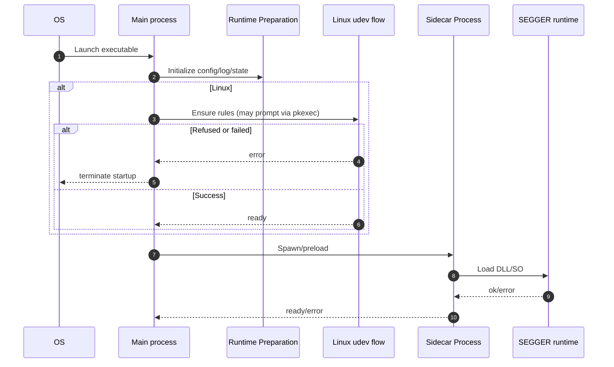
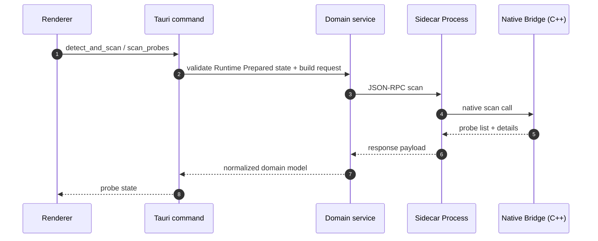
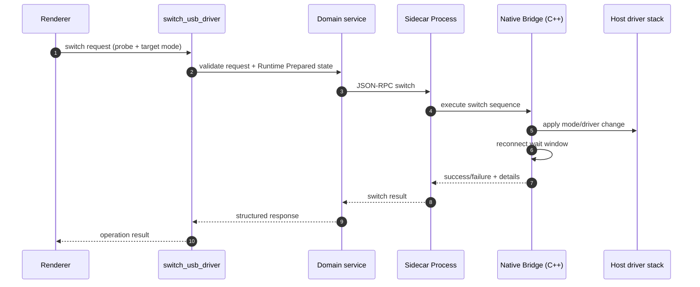

# Workflow Specification

## Purpose

Define runtime behavior for the key operational paths:

- Startup/bootstrap
- Probe refresh/scan
- WinUSB Switch Flow

---

## Scope

In scope:

- Startup bootstrap behavior, including Linux strict udev policy handling.
- Probe discovery and refresh behavior across startup/manual/post-switch paths.
- Switch-to-WinUSB operational flow and result propagation.

Out of scope:

- UI layout and component-level rendering behavior.
- Low-level command primitive details (covered in `spec/JLINK_COMMAND_WORKFLOWS.md`).

---

## Preconditions

- Runtime Preparation has been wired into startup flow.
- Sidecar Process can be spawned from the main process.
- Command handlers remain mapped through `commands.rs` into domain services.

---

## Flow

### Workflow map

---

### WF-01 Startup/bootstrap

### Preconditions

- Bundled runtime resources are present in the app package.

### Sequence

### Failure handling

- Runtime Preparation failure -> startup blocked with actionable error.
- Linux rules refusal/failure -> app exits by policy (strict environment).
- If another app instance is already running, startup is blocked and the user is notified.

### Design notes

- Runtime initialization opens a single append-only user log file and writes explicit session start/end markers.
- App runtime data for `com.winusbswitcher.lite` (logs/cache) is stored under the installation directory, not under user profile locations such as `AppData`.

---

### WF-02 Refresh and scan

### Trigger

- App startup, manual refresh, or post-switch verification.

### Sequence

### Design notes

- Parsing/normalization belongs to backend, not UI.
- UI should treat returned state as canonical and avoid stale index assumptions.

---

### WF-03 WinUSB Switch Flow

### Trigger

- User initiates WinUSB Switch Flow from dashboard.

### Sequence

### Failure handling

- Runtime not prepared -> operation rejected early.
- Sidecar Process interruption -> error propagated with restart/retry path.
- Re-enumeration timing miss -> failure surfaced; user can retry after refresh.

---

## Ownership

- Command entrypoints: `src-tauri/src/commands.rs`
- Workflow orchestration: `src-tauri/src/domain/probe/*`, `src-tauri/src/domain/jlink/*`
- Sidecar Process/Native Bridge execution: `src-tauri/src/bridge_sidecar.rs`, `src-tauri/native/jlink/*`

