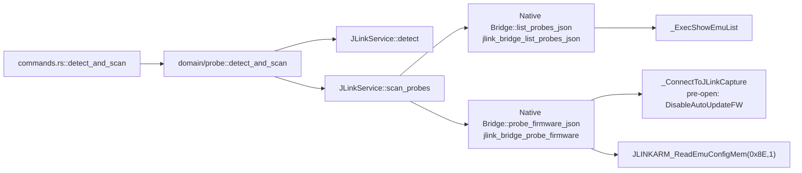
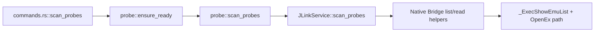
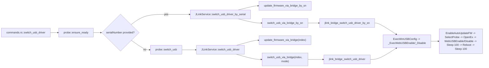
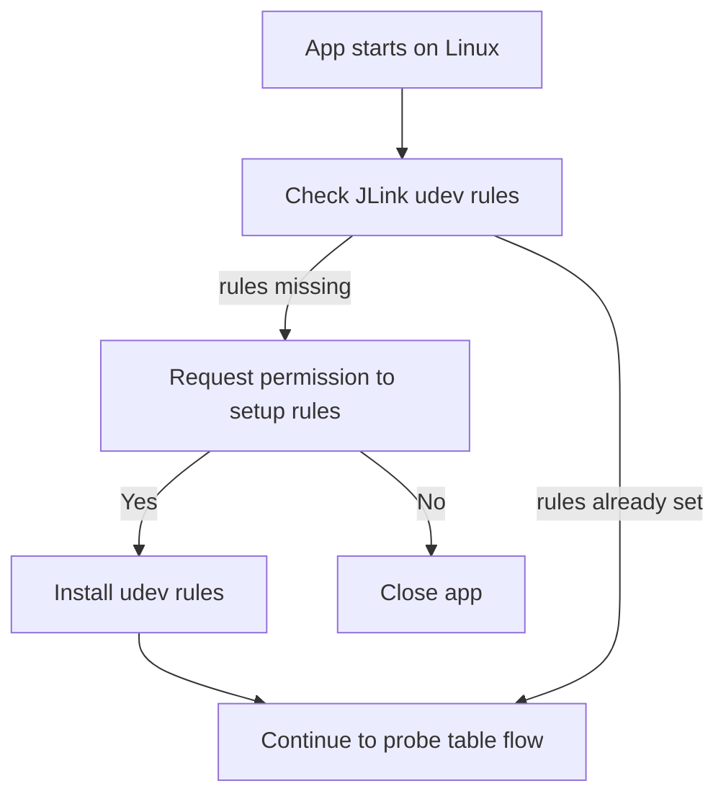
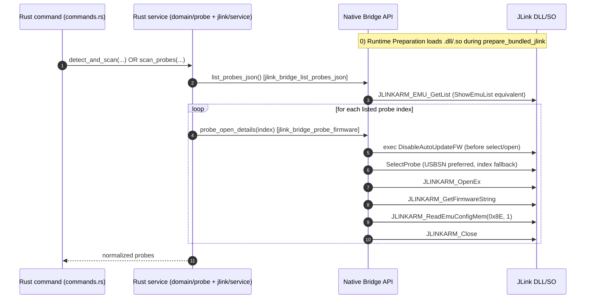
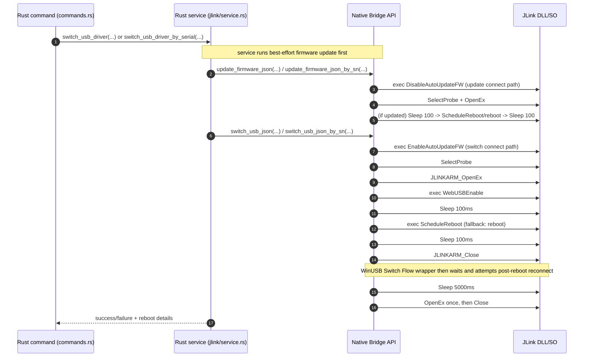

# JLink Low-Level Command Workflows

## Purpose

Provide an implementation-aligned, low-level command view of JLink interactions for:

- app startup
- `Refresh list`
- WinUSB Switch Flow

This document is intentionally close to the current native implementation in:

- `src-tauri/native/jlink/commander_exec.cpp`
- `src-tauri/native/jlink/jlink_bridge_api.cpp`

---

## Command primitives used by current implementation

- Runtime Preparation load step: `jlink_bridge_load()` -> `LoadLibrary` / `dlopen`
- Probe list: `JLINKARM_EMU_GetList` (Commander-equivalent: `ShowEmuList`)
- Pre-open firmware policy toggles:
  - `exec DisableAutoUpdateFW` (scan/connect paths)
  - `exec EnableAutoUpdateFW` (switch/update paths)
- Probe select:
  - `JLINKARM_EMU_SelectByUSBSN` (preferred for USB)
  - fallback `JLINKARM_EMU_SelectByIndex`
- Connect/disconnect:
  - `JLINKARM_OpenEx`
  - `JLINKARM_Close`
- USB mode read:
  - `JLINKARM_ReadEmuConfigMem(&cfg, 0x8E, 1)` (bit 3 indicates SEGGER vs WinUSB mode)
- USB mode switch:
  - preferred: `exec WebUSBEnable` / `exec WebUSBDisable`
  - fallback: direct config-memory write via `JLINKARM_WriteEmuConfigMem`
- Reboot:
  - preferred `exec ScheduleReboot`
  - fallback `exec reboot`

---

## Backend call-chain mapping (Rust -> Native)

This section maps the exact backend call path for the three main user actions.

## 1) `detect_and_scan`

## 2) `scan_probes`

## 3) `switch_usb_driver`

---

## Startup and refresh workflow (scan/probe info)

## A. Linux startup gate (udev policy)

Expected behavior:

- If user refuses setup (`No`), app exits.
- If setup succeeds or rules already exist, app continues to scan/probe table.

## B. Low-level scan sequence (open app and `Refresh list`)

Backend entrypoints:

- App open path: `commands.rs::detect_and_scan`
- Refresh path: `commands.rs::scan_probes`

### Notes for scan

- Firmware auto-update is intentionally disabled for scan/connect path via `DisableAutoUpdateFW`.
- Probe info shown in table originates from list + per-probe open/read steps.

---

## WinUSB Switch Flow

Backend entrypoint:

- `commands.rs::switch_usb_driver`
- Branch:
  - with `serialNumber` -> `JLinkService::switch_usb_driver_by_serial`
  - without `serialNumber` -> `probe::switch_usb` -> `JLinkService::switch_usb_driver`

### Notes for switch

- Current implementation is two-phase in Rust service:
  1. best-effort firmware update
  2. USB mode switch
- Switch phase matches Commander-style order:
  - `EnableAutoUpdateFW` -> select/open -> `WebUSBEnable` -> `Sleep 100` -> reboot -> `Sleep 100`
- After WinUSB Switch Flow, Native Bridge performs additional reconnect wait/check (`Sleep 5000` + one reconnect attempt).

---

## Mapping to your requested workflow

Requested items and implementation status:

- Runtime Preparation load (`.dll/.so`) -> implemented in `jlink_bridge_load`.
- `ShowEmuList` -> implemented via `JLINKARM_EMU_GetList`.
- `exec DisableAutoUpdateFW` on open/refresh -> implemented in connect helpers.
- `SelectProbe` -> implemented (USBSN preferred, index fallback).
- `JLINKARM_ReadEmuConfigMem(..., 0x8E, 1)` for USB mode -> implemented.
- WinUSB Switch Flow `EnableAutoUpdateFW` -> `SelectProbe` -> `WebUSBEnable` -> `Sleep 100` -> `Reboot` -> `Sleep 100` -> implemented (with `ScheduleReboot` preferred and `reboot` fallback).

